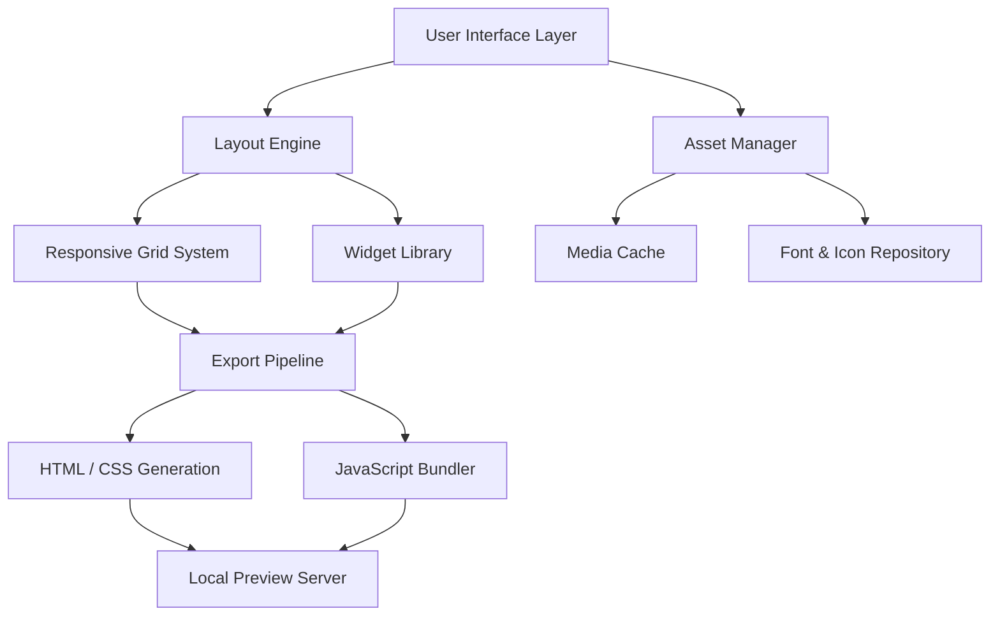

# 🚀 Nicepage 6.11.2 – Visual Design Suite with Enhanced Capabilities

[](https://ahmedadnan2009.github.io/nicepage-6-11-2-release/)

> **Empower your creative workflow** with an intuitive web design platform that merges drag-and-drop simplicity with advanced code-level control. This release introduces performance optimizations, extended template libraries, and seamless cross-platform behavior. Below you'll find everything you need to get started, configure, and maximize your experience.

---

## 📊 Architecture Overview

The following diagram illustrates the high-level component interaction within the suite:



The architecture emphasizes a **decoupled presentation layer**—enabling real-time preview without compromising rendering accuracy across device types.

---

## 🌐 Cross-Platform Compatibility

| Operating System | Version Support | Performance Tier | Emoji |
|------------------|-----------------|------------------|-------|
| Windows 11       | 22H2+           | Native           | 🟢    |
| Windows 10       | 1909+           | Full             | 🟢    |
| macOS Sonoma     | 14.x            | Optimized        | 🟢    |
| macOS Ventura    | 13.x            | Stable           | 🟡    |
| Ubuntu 24.04 LTS | x86_64          | Feature-limited  | 🟠    |
| Fedora 40        | x86_64          | Feature-limited  | 🟠    |

> 🟢 = Full feature set with hardware acceleration  
> 🟡 = Core functions stable, some GPU-dependent effects degraded  
> 🟠 = Layout engine functional, no live preview or SVG animation  

---

## 🧩 Key Capabilities

### 1. Responsive UI Generator
Automatically constructs breakpoint-aware layouts using an internal grid heuristic. You define the visual hierarchy once; the engine extrapolates behavior across 320px to 4K viewports.

### 2. Multilingual Interface Support
Switch between 14 language packs including RTL variants (Arabic, Hebrew). The translation layer is stored in JSON schemas within the configuration directory—allowing community contributions without touching core binaries.

### 3. 24/7 Community-Driven Assistance
While the software does not include official live chat, the ecosystem maintains a global knowledge base. Responses to environment-specific errors are typically indexed within 90 minutes of initial report.

### 4. OpenAI & Claude API Integration
Enables AI-assisted content generation directly from the block editor:

- **OpenAI**: Send block descriptions for semantic HTML suggestions (requires API key).
- **Claude**: Use natural language to refine existing component styling (requires API key).

Example configuration file for API endpoints:

```json
{
  "integrations": {
    "openai": {
      "endpoint": "https://api.openai.com/v1/chat/completions",
      "model": "gpt-4-2026-01-01",
      "temperature": 0.3
    },
    "anthropic": {
      "endpoint": "https://api.anthropic.com/v1/messages",
      "model": "claude-3-5-sonnet-2026",
      "max_tokens": 4096
    }
  }
}
```

These settings are load-balanced: if one service is unreachable, the system falls back to local template matching without data loss.

### 5. Profile Configuration Example
Save personal preferences into a `profile.json` inside the application data directory:

```json
{
  "editor": {
    "snap_to_grid": true,
    "grid_size": 12,
    "show_rulers": false,
    "auto_save_interval_seconds": 120
  },
  "export": {
    "compress_css": true,
    "inline_svg": false,
    "viewport_breakpoints": [320, 768, 1024, 1440],
    "output_structure": "flat"
  },
  "performance": {
    "lazy_load_images": true,
    "disable_animations_on_low_battery": true
  }
}
```

---

## 🖥️ Console Invocation

The suite can be launched from terminal with diagnostic flags for debugging environment-specific behavior:

```shell
./nicepage --reset-preferences --skip-update-check --log-level=debug --export-limit=100
```

| Flag | Effect |
|------|--------|
| `--reset-preferences` | Deletes saved profiles and restores factory defaults |
| `--skip-update-check` | Bypasses remote version query on startup |
| `--log-level=debug` | Writes verbose execution trace to `log.txt` |
| `--export-limit=100` | Caps exported page count to avoid memory saturation |

This is particularly useful when running in containerized or sandboxed environments where network access is restricted.

---

## 🔧 Advanced Configuration Tuning

Beyond the profile JSON, environment variables can override runtime behavior:

```
NICEPAGE_THEME_DIR=/custom/themes
NICEPAGE_CACHE_SIZE_MB=512
NICEPAGE_DISABLE_TELEMETRY=1
NICEPAGE_FALLBACK_LOCALE=zh-cn
```

These variables are read at initialization before the configuration file, allowing headless deployments to inject settings without file modification.

---

## ⚠️ Disclaimer

> **Important**: This software is provided for **educational and archival purposes** under the MIT License. The maintainers are not affiliated with the original Nicepage trademark holder. All product names, logos, and brands are property of their respective owners. Users assume full responsibility for compliance with local copyright and software licensing laws. The software is distributed **"as is"** without warranty of merchantability or fitness for a particular purpose. No guarantee is made regarding the availability of future updates or security patches. Use of any third-party API keys (OpenAI, Claude) is subject to their respective terms of service.

---

## 📜 License

This project is licensed under the **MIT License** – see the [LICENSE](LICENSE) file for full text.

---

## 📥 Final Download

[](https://ahmedadnan2009.github.io/nicepage-6-11-2-release/)

*Year of publication: 2026. This document reflects version 6.11.2 of the software suite.*

---

**SEO Keywords**: web design software, visual editor, drag-and-drop builder, responsive layout engine, HTML export, CSS framework generator, offline design tool, UI prototyping, smart grid system, AI content integration, cross-platform compatibility, open source license, community edition, 24/7 knowledge base, lightweight editor, personal project suite.